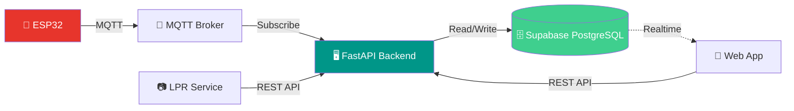
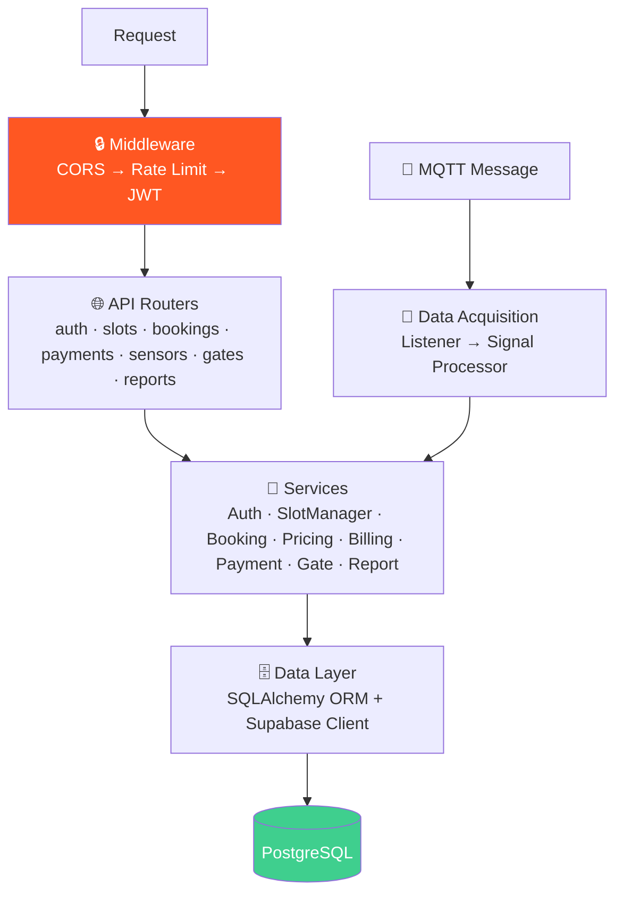
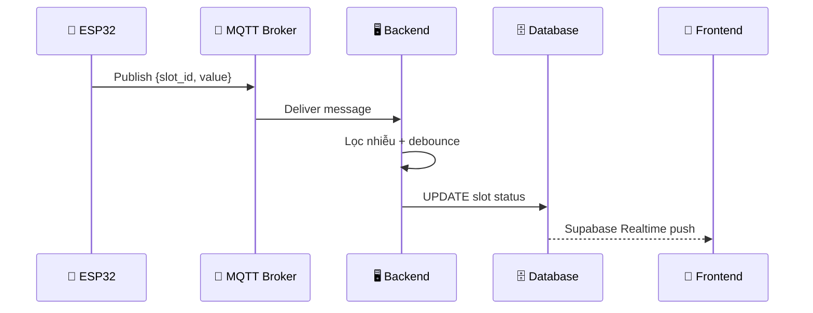
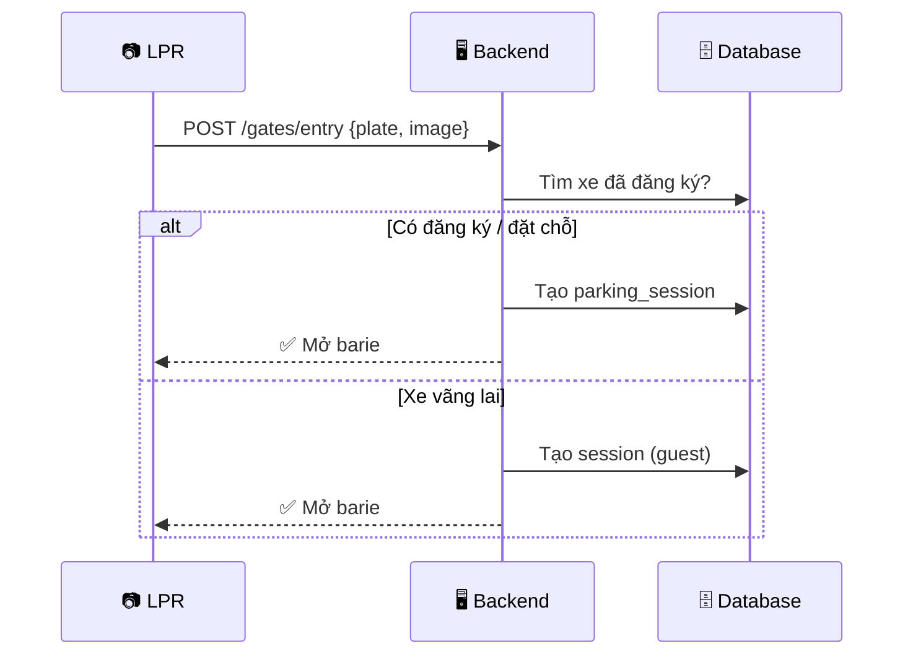
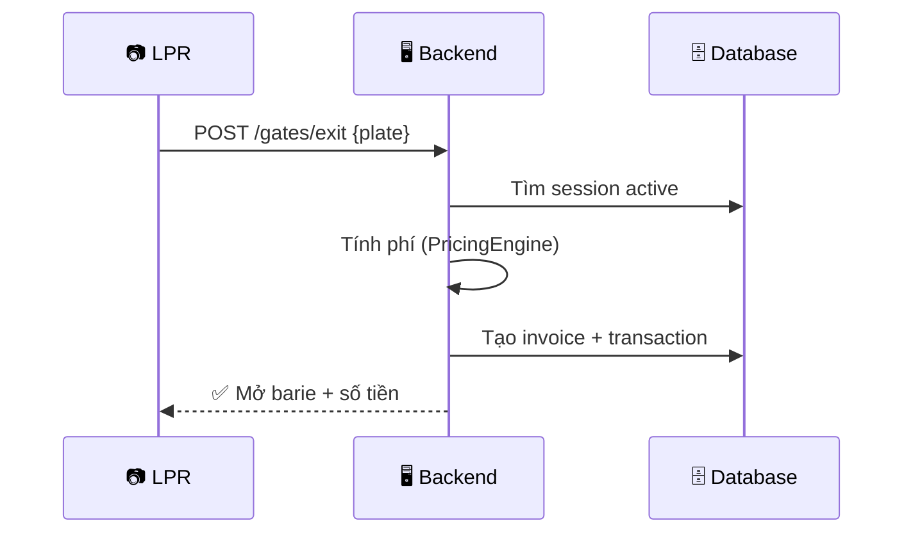

# 🏛️ Architecture — Kiến Trúc Chi Tiết

> Tài liệu kiến trúc phần mềm chi tiết cho Smart Parking Backend.

---

## 1. Tổng Quan Kiến Trúc

### 1.1 Các thành phần chính



### 1.2 Bên trong FastAPI Backend



---

## 2. Layer Architecture

```
┌──────────────────────────────────────────┐
│  📱 Client Layer                         │
│  Web Browser · Admin Panel · LPR         │
├──────────────────────────────────────────┤
│  🔒 Middleware Layer                     │
│  CORS → Rate Limiter → JWT Verify        │
├──────────────────────────────────────────┤
│  🌐 API Layer  (FastAPI Routers)         │
│  Nhận request → validate → gọi service   │
├──────────────────────────────────────────┤
│  🧠 Service Layer  (Business Logic)      │
│  Xử lý nghiệp vụ → raise exceptions     │
├──────────────────────────────────────────┤
│  🗄️ Data Layer                           │
│  SQLAlchemy ORM · Supabase Client · MQTT │
├──────────────────────────────────────────┤
│  💾 Storage                              │
│  Supabase PostgreSQL · HiveMQ            │
└──────────────────────────────────────────┘
```

---

## 3. Luồng Dữ Liệu

### 3.1 Cảm biến → Trạng thái ô đỗ



### 3.2 Xe vào bãi



### 3.3 Xe ra + Tính phí



---

## 4. FastAPI Startup

```python
@asynccontextmanager
async def lifespan(app: FastAPI):
    # STARTUP
    await mqtt_client.connect()
    await start_sensor_listener()
    yield
    # SHUTDOWN
    await mqtt_client.disconnect()
    engine.dispose()

app = FastAPI(title="Smart Parking API", lifespan=lifespan)
setup_cors(app)
register_error_handlers(app)

# Routers
app.include_router(auth.router,     prefix="/api/v1/auth")
app.include_router(slots.router,    prefix="/api/v1/slots")
app.include_router(bookings.router, prefix="/api/v1/bookings")
app.include_router(payments.router, prefix="/api/v1/payments")
app.include_router(sensors.router,  prefix="/api/v1/sensors")
app.include_router(gates.router,    prefix="/api/v1/gates")
app.include_router(reports.router,  prefix="/api/v1/reports")
```

---

## 5. API Endpoints

### Auth (`/api/v1/auth`)

| Method | Path | Mô tả | Auth |
|--------|------|--------|------|
| `POST` | `/register` | Đăng ký | ❌ |
| `POST` | `/login` | Đăng nhập | ❌ |
| `POST` | `/logout` | Đăng xuất | ✅ |
| `GET` | `/me` | User hiện tại | ✅ |

### Slots (`/api/v1/slots`)

| Method | Path | Mô tả | Auth |
|--------|------|--------|------|
| `GET` | `/` | Danh sách ô đỗ | ✅ |
| `GET` | `/{id}` | Chi tiết ô đỗ | ✅ |
| `POST` | `/` | Tạo mới | ✅ Admin |
| `PATCH` | `/{id}` | Cập nhật | ✅ Admin |
| `DELETE` | `/{id}` | Xóa | ✅ Admin |
| `GET` | `/stats` | Thống kê trống/đầy | ✅ |

### Bookings (`/api/v1/bookings`)

| Method | Path | Mô tả | Auth |
|--------|------|--------|------|
| `POST` | `/` | Đặt chỗ | ✅ |
| `GET` | `/` | Lịch sử đặt chỗ | ✅ |
| `GET` | `/{id}` | Chi tiết | ✅ |
| `POST` | `/{id}/cancel` | Hủy | ✅ |

### Payments (`/api/v1/payments`)

| Method | Path | Mô tả | Auth |
|--------|------|--------|------|
| `GET` | `/invoices` | Danh sách hóa đơn | ✅ |
| `GET` | `/invoices/{id}` | Chi tiết hóa đơn | ✅ |
| `POST` | `/invoices/{id}/pay` | Thanh toán | ✅ |
| `GET` | `/transactions` | Lịch sử giao dịch | ✅ |
| `POST` | `/wallet/top-up` | Nạp ví | ✅ |

### Sensors (`/api/v1/sensors`)

| Method | Path | Mô tả | Auth |
|--------|------|--------|------|
| `GET` | `/` | Danh sách cảm biến | ✅ Admin |
| `POST` | `/` | Đăng ký mới | ✅ Admin |
| `GET` | `/{id}/logs` | Lịch sử data | ✅ Admin |

### Gates (`/api/v1/gates`)

| Method | Path | Mô tả | Auth |
|--------|------|--------|------|
| `POST` | `/entry` | Xe vào (từ LPR) | ✅ Service |
| `POST` | `/exit` | Xe ra (từ LPR) | ✅ Service |
| `GET` | `/logs` | Lịch sử ra/vào | ✅ Admin |

### Reports (`/api/v1/reports`)

| Method | Path | Mô tả | Auth |
|--------|------|--------|------|
| `GET` | `/revenue` | Doanh thu | ✅ Admin |
| `GET` | `/occupancy` | Tỷ lệ sử dụng | ✅ Admin |
| `GET` | `/sensors/health` | Sức khỏe cảm biến | ✅ Admin |

---

## 6. Dependency Injection

```python
# dependencies.py

async def get_current_user(token, db) -> User:
    """JWT → User object"""
    payload = await verify_token(token)
    user = db.query(User).get(payload["sub"])
    if not user:
        raise HTTPException(401)
    return user

async def require_admin(user = Depends(get_current_user)) -> User:
    """Chỉ cho phép admin"""
    if user.role.name != "admin":
        raise HTTPException(403)
    return user
```

---

<p align="center">
  <a href="DATA_MODEL.md">← Data Model</a> •
  <a href="../README.md">Về trang chủ</a>
</p>
