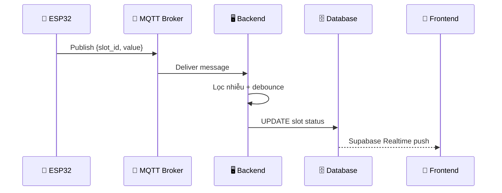
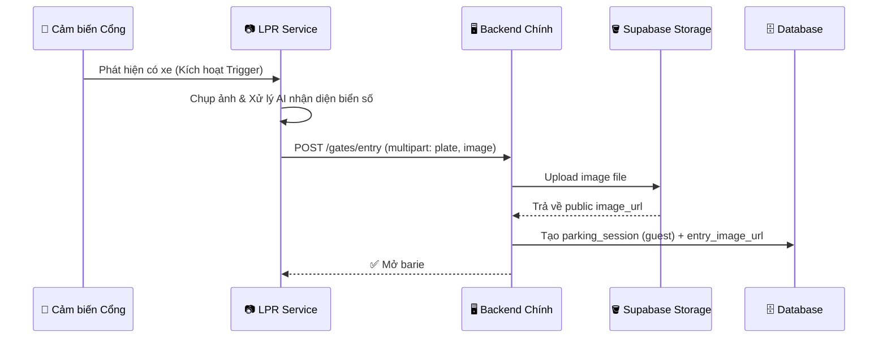
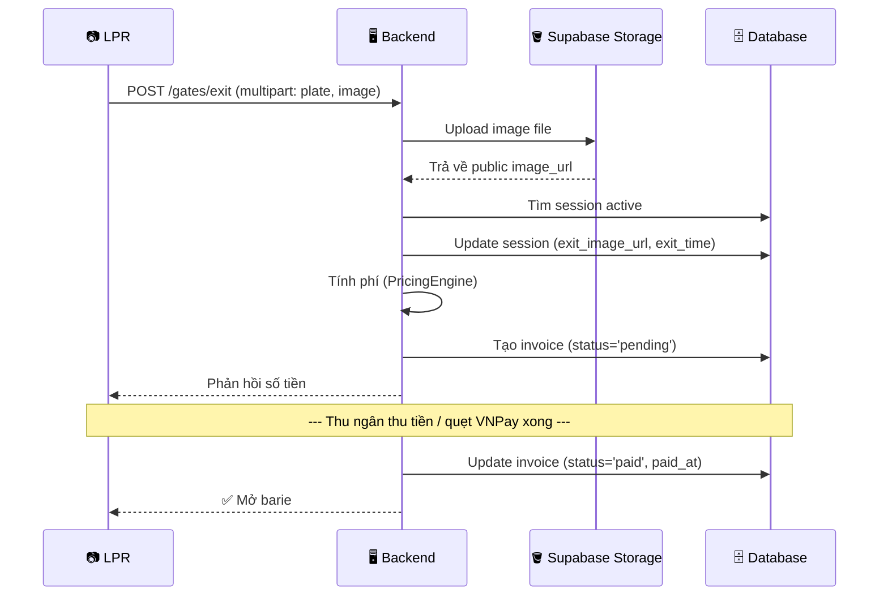

# 🏛️ Architecture — Kiến Trúc Chi Tiết

> Tài liệu kiến trúc phần mềm chi tiết cho Smart Parking Backend.

---

## 1. Tổng Quan Kiến Trúc

### 1.1 Các thành phần chính

```mermaid
graph LR
    ESP_SLOT[📡 ESP32 Ô đỗ] -->|MQTT| MQTT[📨 MQTT Broker]
    MQTT -->|Subscribe| BE[🖥️ FastAPI Backend]
    
    ESP_GATE[📡 ESP32 Cổng] -->|Kích hoạt Trigger| CAM[📷 LPR Service (Backend 2)]
    CAM -->|REST API (plate, image)| BE
    
    WEB[📱 Web App] -->|REST API| BE
    BE -->|Read/Write| DB[(🗄️ Supabase PostgreSQL)]
    DB -.->|Realtime| WEB

    style BE fill:#009688,color:#fff
    style DB fill:#3FCF8E,color:#fff
    style CAM fill:#ff9800,color:#fff
```

---

## 2. Luồng Dữ Liệu

### 3.1 Cảm biến → Trạng thái ô đỗ



### 2.2 Xe vào bãi



### 2.3 Xe ra + Tính phí



---

## 4. FastAPI Startup

```python
@asynccontextmanager
async def lifespan(app: FastAPI):
    # STARTUP
    await mqtt_client.connect()
    await start_sensor_listener()
    yield
    # SHUTDOWN
    await mqtt_client.disconnect()
    engine.dispose()

app = FastAPI(title="Smart Parking API", lifespan=lifespan)
setup_cors(app)
register_error_handlers(app)

# Routers
app.include_router(auth.router,     prefix="/api/v1/auth")
app.include_router(slots.router,    prefix="/api/v1/slots")
app.include_router(payments.router, prefix="/api/v1/payments")
app.include_router(sensors.router,  prefix="/api/v1/sensors")
app.include_router(gates.router,    prefix="/api/v1/gates")
app.include_router(reports.router,  prefix="/api/v1/reports")
```

---

## 5. API Endpoints

### Auth (`/api/v1/auth`)

| Method | Path | Mô tả | Auth |
|--------|------|--------|------|
| `POST` | `/register` | Đăng ký | ❌ |
| `POST` | `/login` | Đăng nhập | ❌ |
| `POST` | `/logout` | Đăng xuất | ✅ |
| `GET` | `/me` | User hiện tại | ✅ |

### Slots (`/api/v1/slots`)

| Method | Path | Mô tả | Auth |
|--------|------|--------|------|
| `GET` | `/` | Danh sách ô đỗ | ✅ |
| `GET` | `/{id}` | Chi tiết ô đỗ | ✅ |
| `POST` | `/` | Tạo mới | ✅ Admin |
| `PATCH` | `/{id}` | Cập nhật | ✅ Admin |
| `DELETE` | `/{id}` | Xóa | ✅ Admin |
| `GET` | `/stats` | Thống kê trống/đầy | ✅ |

### Payments / Invoices (`/api/v1/payments`)

| Method | Path | Mô tả | Auth |
|--------|------|--------|------|
| `GET` | `/invoices` | Danh sách hóa đơn | ✅ |
| `GET` | `/invoices/{id}` | Chi tiết hóa đơn | ✅ |
| `POST` | `/invoices/{id}/pay` | Call khi thu tiền xong (để update status='paid') | ✅ |

### Sensors (`/api/v1/sensors`)

| Method | Path | Mô tả | Auth |
|--------|------|--------|------|
| `GET` | `/` | Danh sách cảm biến | ✅ Admin |
| `POST` | `/` | Đăng ký mới | ✅ Admin |
| `GET` | `/{id}/logs` | Lịch sử data | ✅ Admin |

### Gates (`/api/v1/gates`)

| Method | Path | Mô tả | Auth |
|--------|------|--------|------|
| `POST` | `/entry` | Nhận diện biển số, upload ảnh + mở barie vào | ❌ (LPR gọi nội bộ) |
| `POST` | `/exit` | Nhận diện biển số, upload ảnh + báo giá tiền | ❌ (LPR gọi nội bộ) |
| `POST` | `/{id}/manual-open` | Nhân viên mở cổng bằng tay | ✅ |
| `GET` | `/logs` | Lịch sử ra/vào | ✅ Admin |

### Reports (`/api/v1/reports`)

| Method | Path | Mô tả | Auth |
|--------|------|--------|------|
| `GET` | `/revenue` | Doanh thu | ✅ Admin |
| `GET` | `/occupancy` | Tỷ lệ sử dụng | ✅ Admin |
| `GET` | `/sensors/health` | Sức khỏe cảm biến | ✅ Admin |

---

## 6. Dependency Injection

```python
# dependencies.py

async def get_current_user(token, db) -> User:
    """JWT → User object"""
    payload = await verify_token(token)
    user = db.query(User).get(payload["sub"])
    if not user:
        raise HTTPException(401)
    return user

async def require_admin(user = Depends(get_current_user)) -> User:
    """Chỉ cho phép admin"""
    if user.role.name != "admin":
        raise HTTPException(403)
    return user
```

---

<p align="center">
  <a href="DATA_MODEL.md">← Data Model</a> •
  <a href="../README.md">Về trang chủ</a>
</p>
