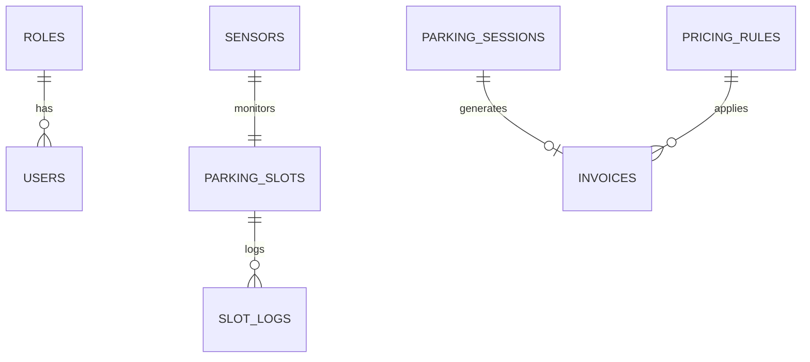

# 🗄️ Data Model — Mô Hình Dữ Liệu

> Thiết kế database cho Smart Parking Management System trên Supabase (PostgreSQL).

> [!NOTE]
> **Tại sao bảng `users` không có password?**
> Vì **Supabase Auth** quản lý password (hash, verify, reset). Bảng `users` ở đây chỉ là **profile bổ sung** — liên kết với Supabase Auth qua `id` (UUID).

---

## 1. ER Diagram

## 2. Bảng Lookup (Reference Tables)

### `roles` — Vai trò

| Column | Type | Constraints | Mô tả |
|--------|------|------------|--------|
| `id` | `serial` | PK | Auto-increment |
| `name` | `varchar(20)` | UNIQUE, NOT NULL | `user`, `admin`, `operator`... |
| `description` | `varchar(100)` | NULLABLE | Mô tả vai trò |

**Seed data:**

| id | name | description |
|----|------|-------------|
| 1 | `user` | Người dùng thường |
| 2 | `admin` | Quản trị viên |

### `users` — Người dùng (Profile)

> ⚠️ Password do Supabase Auth quản lý. Bảng này chỉ lưu thông tin profile.

| Column | Type | Constraints | Mô tả |
|--------|------|------------|--------|
| `id` | `uuid` | PK | = Supabase Auth UID |
| `email` | `varchar(255)` | UNIQUE, NOT NULL | Email đăng nhập |
| `full_name` | `varchar(100)` | NOT NULL | Họ tên |
|'password'| `varchar(100)` | NOT NULL | mật khẩu |
| `phone` | `varchar(20)` | NULLABLE | SĐT |
| `role_id` | `int` | FK → `roles.id`, DEFAULT `1` | Vai trò |
| `created_at` | `timestamptz` | DEFAULT `now()` | — |
| `updated_at` | `timestamptz` | DEFAULT `now()` | — |

### `parking_slots` — Ô đỗ xe

| Column | Type | Constraints | Mô tả |
|--------|------|------------|--------|
| `id` | `uuid` | PK | — |
| `slot_code` | `varchar(10)` | UNIQUE, NOT NULL | `A01`, `B12` |
| `status` | `varchar(20)` | DEFAULT `'available'` | `available` · `occupied` · `maintenance` |
| `position_x` | `int` | NULLABLE | Tọa độ X trên sơ đồ |
| `position_y` | `int` | NULLABLE | Tọa độ Y trên sơ đồ |
| `updated_at` | `timestamptz` | DEFAULT `now()` | — |

### `sensors` — Cảm biến

| Column | Type | Constraints | Mô tả |
|--------|------|------------|--------|
| `id` | `uuid` | PK | — |
| `sensor_code` | `varchar(20)` | UNIQUE, NOT NULL | `IR_A01` |
| `slot_id` | `uuid` | FK → `parking_slots.id`, NULLABLE | Ô đỗ mà sensor giám sát |
| `status` | `varchar(20)` | DEFAULT `'offline'` | `online` · `offline` · `error` |
| `last_heartbeat` | `timestamptz` | NULLABLE | Lần heartbeat cuối |
| `created_at` | `timestamptz` | DEFAULT `now()` | — |

### `parking_sessions` — Phiên đỗ xe

| Column | Type | Constraints | Mô tả |
|--------|------|------------|--------|
| `id` | `uuid` | PK | — |
| `plate_number` | `varchar(20)` | NOT NULL | Biển số nhận diện |
| `entry_time` | `timestamptz` | NOT NULL | Giờ vào |
| `exit_time` | `timestamptz` | NULLABLE | NULL = đang đỗ |
| `status` | `varchar(20)` | DEFAULT `'active'` | `active` · `completed` |
| `entry_image_url` | `text` | NULLABLE | URL ảnh khi vào |
| `exit_image_url` | `text` | NULLABLE | URL ảnh khi ra |
| `created_at` | `timestamptz` | DEFAULT `now()` | — |

> [!NOTE]
> **Lưu trữ hình ảnh LPR**: Cột `entry_image_url` và `exit_image_url` lưu trữ Public URL. Các file ảnh gốc dạng nhị phân sẽ được Backend tự động upload lên **Supabase Storage** (ví dụ bucket tên `parking-images`) rồi lấy public URL để lưu vào bảng này.

### `pricing_rules` — Bảng giá

| Column | Type | Constraints | Mô tả |
|--------|------|------------|--------|
| `id` | `uuid` | PK | — |
| `name` | `varchar(50)` | NOT NULL | `Giờ thường`, `Qua đêm`, `Cuối tuần` |
| `price_per_hour` | `decimal(10,2)` | NOT NULL | Giá/giờ (VNĐ) |
| `price_per_day` | `decimal(10,2)` | NULLABLE | Giá trọn ngày |
| `min_charge` | `decimal(10,2)` | DEFAULT `0` | Phí tối thiểu |
| `apply_after_minutes` | `int` | DEFAULT `0` | Miễn phí X phút đầu |
| `start_time` | `time` | NULLABLE | Bắt đầu khung giờ |
| `end_time` | `time` | NULLABLE | Kết thúc khung giờ |
| `days_of_week` | `varchar(20)` | NULLABLE | `MON-FRI` hoặc `SAT-SUN` hoặc NULL = tất cả |
| `priority` | `int` | DEFAULT `0` | Rule priority cao hơn sẽ được ưu tiên |
| `is_active` | `boolean` | DEFAULT `true` | Đang áp dụng |
| `created_at` | `timestamptz` | DEFAULT `now()` | — |

> [!TIP]
> **Logic chọn pricing rule**: Hệ thống MVP mặc định áp dụng cho ô tô/xe máy giống nhau, tìm rule matching (khung giờ + ngày trong tuần), sort theo `priority` DESC, lấy rule đầu tiên. Nếu không match rule nào → dùng rule mặc định (priority = 0).

### `invoices` — Hóa đơn

| Column | Type | Constraints | Mô tả |
|--------|------|------------|--------|
| `id` | `uuid` | PK | — |
| `session_id` | `uuid` | FK → `parking_sessions.id`, UNIQUE | 1 session → 1 invoice |
| `pricing_rule_id` | `uuid` | FK → `pricing_rules.id` | Rule đã áp dụng |
| `duration_minutes` | `decimal(8,2)` | NOT NULL | Thời gian đỗ (phút) |
| `amount` | `decimal(12,2)` | NOT NULL | Tổng tiền cần thu |
| `status` | `varchar(20)` | DEFAULT `'pending'` | `pending` · `paid` · `cancelled` |
| `payment_method` | `varchar(20)` | NULLABLE | `cash` · `vnpay` · `momo` (NULL nếu chưa trả) |
| `paid_at` | `timestamptz` | NULLABLE | Thời điểm thanh toán |
| `created_at` | `timestamptz` | DEFAULT `now()` | — |

---

---

## 5. Indexes

| Bảng | Index | Columns | Lý do |
|------|-------|---------|-------|
| `parking_slots` | `idx_slots_status` | `status` | Tìm ô trống |
| `parking_slots` | `idx_slots_zone` | `zone, floor` | Lọc theo khu |
| `parking_sessions` | `idx_sessions_active` | `status` | Session đang active |
| `parking_sessions` | `idx_sessions_plate` | `plate_number` | Tìm theo biển số |
| `invoices` | `idx_invoices_status` | `status, created_at` | Lọc hóa đơn chờ/đã thu |
| `sensors` | `idx_sensors_status` | `status` | Tìm offline |
| `pricing_rules` | `idx_pricing_active` | `is_active, priority` | Tìm rule nhanh |

---

## 6. Supabase Realtime

Bật Realtime cho các bảng cần cập nhật real-time:

| Bảng | Events | Frontend dùng để |
|------|--------|-----------------|
| `parking_slots` | `UPDATE` | Cập nhật sơ đồ bãi xe |
| `sensors` | `UPDATE` | Dashboard trạng thái sensor |

---

## 7. Row Level Security (RLS)

| Bảng | SELECT | INSERT/UPDATE/DELETE |
|------|--------|---------------------|
| `users` | Chỉ xem profile mình | Chỉ sửa profile mình |
| `parking_slots` | Tất cả | Admin only |
| `invoices` | Xem hóa đơn mình / Admin xem tất cả | System only |
| `sensors` | Admin only | Admin only |
| `pricing_rules` | Tất cả (đọc giá) | Admin only |

---

## 8. Seed Data Mẫu

📌 Pricing Rules

| name | price/h | min_charge | apply_after | days | priority |
|------|---------|------------|-------------|------|----------|
| Giờ thường | 5,000 | 3,000 | 15 phút | MON-FRI | 1 |
| Qua đêm | 10,000 | 10,000 | 0 | ALL | 0 |
| Cuối tuần | 7,000 | 5,000 | 15 phút | SAT-SUN | 2 |

📌 Parking Slots (20 ô mẫu)

| slot_code | zone | floor |
|-----------|------|-------|
| A01 – A10 | A | 1 |
| B01 – B10 | B | 1 |

---

  <a href="MVP_SCOPE.md">← MVP Scope</a> •
  <a href="ARCHITECTURE.md">Architecture →</a>

