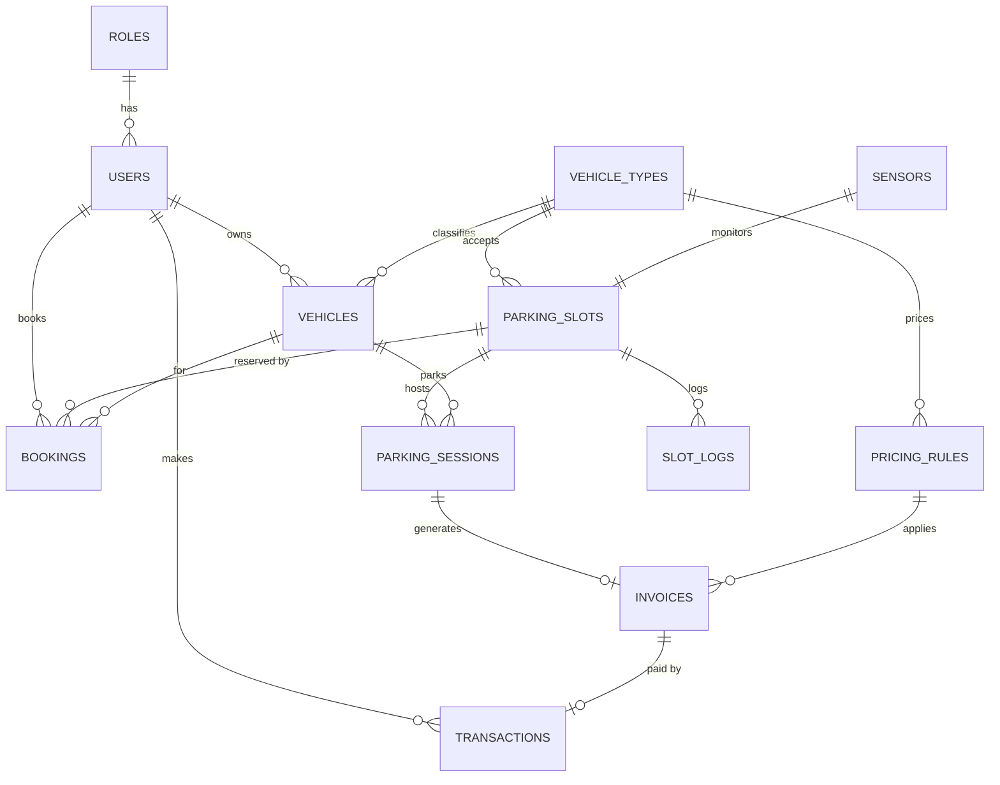

# 🗄️ Data Model — Mô Hình Dữ Liệu

> Thiết kế database cho Smart Parking Management System trên Supabase (PostgreSQL).

> [!NOTE]
> **Tại sao bảng `users` không có password?**
> Vì **Supabase Auth** quản lý password (hash, verify, reset). Bảng `users` ở đây chỉ là **profile bổ sung** — liên kết với Supabase Auth qua `id` (UUID).

---

## 1. ER Diagram

## 2. Bảng Lookup (Reference Tables)

### `roles` — Vai trò

| Column | Type | Constraints | Mô tả |
|--------|------|------------|--------|
| `id` | `serial` | PK | Auto-increment |
| `name` | `varchar(20)` | UNIQUE, NOT NULL | `user`, `admin`, `operator`... |
| `description` | `varchar(100)` | NULLABLE | Mô tả vai trò |

**Seed data:**

| id | name | description |
|----|------|-------------|
| 1 | `user` | Người dùng thường |
| 2 | `admin` | Quản trị viên |

### `vehicle_types` — Loại xe

| Column | Type | Constraints | Mô tả |
|--------|------|------------|--------|
| `id` | `serial` | PK | Auto-increment |
| `name` | `varchar(20)` | UNIQUE, NOT NULL | `motorbike`, `car`, `electric` |
| `display_name` | `varchar(50)` | NOT NULL | `Xe máy`, `Ô tô`, `Xe điện` |
| `icon` | `varchar(10)` | NULLABLE | Emoji: `🏍️`, `🚗`, `⚡` |

**Seed data:**

| id | name | display_name | icon |
|----|------|-------------|------|
| 1 | `motorbike` | Xe máy | 🏍️ |
| 2 | `car` | Ô tô | 🚗 |
| 3 | `electric` | Xe điện | ⚡ |

---

## 3. Bảng Chính

### `users` — Người dùng (Profile)

> ⚠️ Password do Supabase Auth quản lý. Bảng này chỉ lưu thông tin profile.

| Column | Type | Constraints | Mô tả |
|--------|------|------------|--------|
| `id` | `uuid` | PK | = Supabase Auth UID |
| `email` | `varchar(255)` | UNIQUE, NOT NULL | Email đăng nhập |
| `full_name` | `varchar(100)` | NOT NULL | Họ tên |
| `phone` | `varchar(20)` | NULLABLE | SĐT |
| `role_id` | `int` | FK → `roles.id`, DEFAULT `1` | Vai trò |
| `wallet_balance` | `decimal(12,2)` | DEFAULT `0.00` | Số dư ví |
| `created_at` | `timestamptz` | DEFAULT `now()` | — |
| `updated_at` | `timestamptz` | DEFAULT `now()` | — |

### `vehicles` — Xe

| Column | Type | Constraints | Mô tả |
|--------|------|------------|--------|
| `id` | `uuid` | PK | — |
| `user_id` | `uuid` | FK → `users.id`, NOT NULL | Chủ xe |
| `vehicle_type_id` | `int` | FK → `vehicle_types.id`, NOT NULL | Loại xe |
| `plate_number` | `varchar(20)` | UNIQUE, NOT NULL | Biển số: `59A-123.45` |
| `brand` | `varchar(50)` | NULLABLE | Hãng xe |
| `is_active` | `boolean` | DEFAULT `true` | Còn dùng |
| `created_at` | `timestamptz` | DEFAULT `now()` | — |

### `parking_slots` — Ô đỗ xe

| Column | Type | Constraints | Mô tả |
|--------|------|------------|--------|
| `id` | `uuid` | PK | — |
| `slot_code` | `varchar(10)` | UNIQUE, NOT NULL | `A01`, `B12` |
| `vehicle_type_id` | `int` | FK → `vehicle_types.id`, NOT NULL | Loại xe chấp nhận |
| `status` | `varchar(20)` | DEFAULT `'available'` | `available` · `occupied` · `reserved` · `maintenance` |
| `zone` | `varchar(5)` | NOT NULL | Khu vực: `A`, `B`, `C` |
| `floor` | `int` | DEFAULT `1` | Tầng |
| `position_x` | `int` | NULLABLE | Tọa độ X trên sơ đồ |
| `position_y` | `int` | NULLABLE | Tọa độ Y trên sơ đồ |
| `sensor_id` | `uuid` | FK → `sensors.id`, NULLABLE | Cảm biến gắn ô này |
| `updated_at` | `timestamptz` | DEFAULT `now()` | — |

### `sensors` — Cảm biến

| Column | Type | Constraints | Mô tả |
|--------|------|------------|--------|
| `id` | `uuid` | PK | — |
| `sensor_code` | `varchar(20)` | UNIQUE, NOT NULL | `IR_A01` |
| `board_id` | `varchar(20)` | NOT NULL | `esp32_01` |
| `slot_id` | `uuid` | FK → `parking_slots.id`, NULLABLE | Ô đỗ mà sensor giám sát |
| `status` | `varchar(20)` | DEFAULT `'offline'` | `online` · `offline` · `error` |
| `last_heartbeat` | `timestamptz` | NULLABLE | Lần heartbeat cuối |
| `created_at` | `timestamptz` | DEFAULT `now()` | — |

### `bookings` — Đặt chỗ trước

| Column | Type | Constraints | Mô tả |
|--------|------|------------|--------|
| `id` | `uuid` | PK | — |
| `user_id` | `uuid` | FK → `users.id`, NOT NULL | Người đặt |
| `vehicle_id` | `uuid` | FK → `vehicles.id`, NOT NULL | Xe nào đặt |
| `slot_id` | `uuid` | FK → `parking_slots.id`, NOT NULL | Ô đỗ |
| `status` | `varchar(20)` | DEFAULT `'pending'` | `pending` · `confirmed` · `cancelled` · `expired` |
| `booked_from` | `timestamptz` | NOT NULL | Bắt đầu giữ chỗ |
| `booked_until` | `timestamptz` | NOT NULL | Hết hạn giữ chỗ |
| `cancelled_at` | `timestamptz` | NULLABLE | Thời điểm hủy |
| `created_at` | `timestamptz` | DEFAULT `now()` | — |

### `parking_sessions` — Phiên đỗ xe

| Column | Type | Constraints | Mô tả |
|--------|------|------------|--------|
| `id` | `uuid` | PK | — |
| `slot_id` | `uuid` | FK → `parking_slots.id`, NOT NULL | Ô đỗ |
| `vehicle_id` | `uuid` | FK → `vehicles.id`, NULLABLE | NULL = xe vãng lai |
| `plate_number` | `varchar(20)` | NOT NULL | Biển số nhận diện |
| `entry_time` | `timestamptz` | NOT NULL | Giờ vào |
| `exit_time` | `timestamptz` | NULLABLE | NULL = đang đỗ |
| `status` | `varchar(20)` | DEFAULT `'active'` | `active` · `completed` |
| `entry_image_url` | `text` | NULLABLE | Ảnh khi vào |
| `exit_image_url` | `text` | NULLABLE | Ảnh khi ra |
| `created_at` | `timestamptz` | DEFAULT `now()` | — |

### `pricing_rules` — Bảng giá

| Column | Type | Constraints | Mô tả |
|--------|------|------------|--------|
| `id` | `uuid` | PK | — |
| `vehicle_type_id` | `int` | FK → `vehicle_types.id`, NOT NULL | Áp dụng cho loại xe nào |
| `name` | `varchar(50)` | NOT NULL | `Giờ thường`, `Qua đêm`, `Cuối tuần` |
| `price_per_hour` | `decimal(10,2)` | NOT NULL | Giá/giờ (VNĐ) |
| `price_per_day` | `decimal(10,2)` | NULLABLE | Giá trọn ngày |
| `min_charge` | `decimal(10,2)` | DEFAULT `0` | Phí tối thiểu |
| `apply_after_minutes` | `int` | DEFAULT `0` | Miễn phí X phút đầu |
| `start_time` | `time` | NULLABLE | Bắt đầu khung giờ |
| `end_time` | `time` | NULLABLE | Kết thúc khung giờ |
| `days_of_week` | `varchar(20)` | NULLABLE | `MON-FRI` hoặc `SAT-SUN` hoặc NULL = tất cả |
| `priority` | `int` | DEFAULT `0` | Rule priority cao hơn sẽ được ưu tiên |
| `is_active` | `boolean` | DEFAULT `true` | Đang áp dụng |
| `created_at` | `timestamptz` | DEFAULT `now()` | — |

> [!TIP]
> **Logic chọn pricing rule**: Khi tính giá, hệ thống tìm rule matching (vehicle_type + khung giờ + ngày trong tuần), sort theo `priority` DESC, lấy rule đầu tiên. Nếu không match rule nào → dùng rule mặc định (priority = 0).

### `invoices` — Hóa đơn

| Column | Type | Constraints | Mô tả |
|--------|------|------------|--------|
| `id` | `uuid` | PK | — |
| `session_id` | `uuid` | FK → `parking_sessions.id`, UNIQUE | 1 session → 1 invoice |
| `pricing_rule_id` | `uuid` | FK → `pricing_rules.id` | Rule đã áp dụng |
| `duration_minutes` | `decimal(8,2)` | NOT NULL | Thời gian đỗ (phút) |
| `base_amount` | `decimal(12,2)` | NOT NULL | Giá gốc |
| `total_amount` | `decimal(12,2)` | NOT NULL | Tổng tiền |
| `status` | `varchar(20)` | DEFAULT `'pending'` | `pending` · `paid` · `cancelled` |
| `created_at` | `timestamptz` | DEFAULT `now()` | — |

### `transactions` — Giao dịch

| Column | Type | Constraints | Mô tả |
|--------|------|------------|--------|
| `id` | `uuid` | PK | — |
| `user_id` | `uuid` | FK → `users.id` | Người thực hiện |
| `invoice_id` | `uuid` | FK → `invoices.id`, NULLABLE | NULL nếu nạp tiền |
| `type` | `varchar(20)` | NOT NULL | `payment` · `top_up` · `refund` |
| `amount` | `decimal(12,2)` | NOT NULL | Số tiền |
| `method` | `varchar(20)` | NOT NULL | `wallet` · `vnpay` · `momo` · `cash` |
| `status` | `varchar(20)` | DEFAULT `'pending'` | `pending` · `success` · `failed` |
| `external_transaction_id` | `varchar(100)` | NULLABLE | ID từ VNPay/Momo |
| `created_at` | `timestamptz` | DEFAULT `now()` | — |

---

## 4. Bảng Log

### `gate_logs` — Log cổng ra/vào

| Column | Type | Constraints | Mô tả |
|--------|------|------------|--------|
| `id` | `uuid` | PK | — |
| `gate_type` | `varchar(10)` | NOT NULL | `entry` · `exit` |
| `plate_number` | `varchar(20)` | NOT NULL | — |
| `image_url` | `text` | NULLABLE | Ảnh chụp |
| `action` | `varchar(10)` | NOT NULL | `open` · `deny` |
| `reason` | `varchar(100)` | NULLABLE | Lý do |
| `created_at` | `timestamptz` | DEFAULT `now()` | — |

---

## 5. Indexes

| Bảng | Index | Columns | Lý do |
|------|-------|---------|-------|
| `parking_slots` | `idx_slots_status` | `status` | Tìm ô trống |
| `parking_slots` | `idx_slots_zone` | `zone, floor` | Lọc theo khu |
| `parking_sessions` | `idx_sessions_active` | `status, slot_id` | Session đang active |
| `parking_sessions` | `idx_sessions_plate` | `plate_number` | Tìm theo biển số |
| `bookings` | `idx_bookings_user` | `user_id, status` | Lịch sử user |
| `bookings` | `idx_bookings_slot` | `slot_id, status` | Kiểm tra ô đã đặt |
| `transactions` | `idx_tx_user` | `user_id, created_at` | Lịch sử giao dịch |
| `sensors` | `idx_sensors_status` | `status` | Tìm offline |
| `pricing_rules` | `idx_pricing_active` | `vehicle_type_id, is_active, priority` | Tìm rule nhanh |

---

## 6. Supabase Realtime

Bật Realtime cho các bảng cần cập nhật real-time:

| Bảng | Events | Frontend dùng để |
|------|--------|-----------------|
| `parking_slots` | `UPDATE` | Cập nhật sơ đồ bãi xe |
| `sensors` | `UPDATE` | Dashboard trạng thái sensor |
| `gate_logs` | `INSERT` | Thông báo xe vào/ra |

---

## 7. Row Level Security (RLS)

| Bảng | SELECT | INSERT/UPDATE/DELETE |
|------|--------|---------------------|
| `users` | Chỉ xem profile mình | Chỉ sửa profile mình |
| `vehicles` | Chỉ xem xe mình | Chỉ CRUD xe mình |
| `bookings` | Chỉ xem booking mình | Chỉ tạo/hủy booking mình |
| `transactions` | Chỉ xem giao dịch mình | System only |
| `parking_slots` | Tất cả | Admin only |
| `invoices` | Xem hóa đơn mình | System only |
| `sensors` | Admin only | Admin only |
| `pricing_rules` | Tất cả (đọc giá) | Admin only |

---

## 8. Seed Data Mẫu

📌 Pricing Rules

| vehicle_type | name | price/h | min_charge | apply_after | days | priority |
|-------------|------|---------|------------|-------------|------|----------|
| Xe máy | Giờ thường | 5,000 | 3,000 | 15 phút | MON-FRI | 1 |
| Xe máy | Qua đêm | 10,000 | 10,000 | 0 | ALL | 0 |
| Xe máy | Cuối tuần | 7,000 | 5,000 | 15 phút | SAT-SUN | 2 |
| Ô tô | Giờ thường | 20,000 | 10,000 | 15 phút | MON-FRI | 1 |
| Ô tô | Qua đêm | 40,000 | 40,000 | 0 | ALL | 0 |
| Ô tô | Cuối tuần | 25,000 | 15,000 | 15 phút | SAT-SUN | 2 |
| Xe điện | Giờ thường | 15,000 | 8,000 | 15 phút | ALL | 1 |

📌 Parking Slots (20 ô mẫu)

| slot_code | vehicle_type | zone | floor |
|-----------|-------------|------|-------|
| A01 – A05 | Xe máy | A | 1 |
| A06 – A10 | Xe máy | A | 1 |
| B01 – B05 | Ô tô | B | 1 |
| B06 – B10 | Ô tô | B | 1 |

---

  <a href="MVP_SCOPE.md">← MVP Scope</a> •
  <a href="ARCHITECTURE.md">Architecture →</a>

