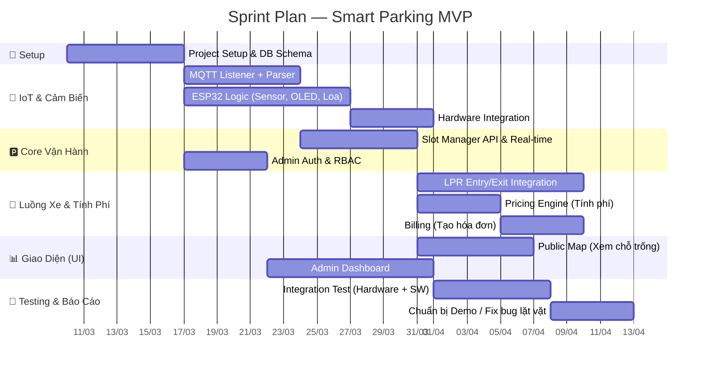

# 🎯 MVP Scope — Phạm Vi Sản Phẩm Tối Thiểu

> Xác định rõ **làm gì trước**, **làm gì sau**, và **không làm gì** để đảm bảo team 5 người ship được sản phẩm demo đúng hạn.

---

## 1. Định Nghĩa MVP

> **MVP (Minimum Viable Product)** = phiên bản **cốt lõi** đủ để chứng minh toàn bộ luồng nghiệp vụ hoạt động xuyên suốt, tập trung vào giá trị chính: tự động hóa theo dõi bãi đỗ + tính tiền.

### Tiêu chí MVP hoàn thành

- [ ] Cảm biến phát hiện xe → gửi MQTT → Server nhận & cập nhật trạng thái ô đỗ ✅
- [ ] Phần cứng (OLED, Loa) hoạt động dựa trên phản hồi từ server ✅
- [ ] Frontend Public (không cần đăng nhập) xem được sơ đồ bãi đỗ tức thời ✅
- [ ] Camera cổng vào/ra nhận diện biển số tự động ✅
- [ ] Hệ thống lưu phiên đỗ, tự tính phí, xuất hóa đơn khi xe ra ✅
- [ ] Admin có thể đăng nhập dashboard quản lý bãi và xem hóa đơn ✅

---

## 2. Phân Loại Tính Năng Mới Xác Nhận (Không Có Booking)

| # | Tính năng | Phân loại | Lý do thiết kế |
|---|----------|-----------|----------------|
| 1 | Xem sơ đồ bãi đỗ real-time | 🔴 **MVP** | Core feature (áp dụng cho cả admin/public) |
| 2 | Xe vào → Nhận diện biển số | 🔴 **MVP** | Core flow |
| 3 | Xe ra → Tính phí + Hóa đơn | 🔴 **MVP** | Core feature |
| 4 | **Dashboard Admin** | 🔴 **MVP** | Quản lý bãi (CRUD ô đỗ) & monitoring |
| 5 | **Admin Auth** (Login) | 🔴 **MVP** | Bảo vệ dashboard |
| 6 | **OLED + Loa** tại bãi | 🔴 **MVP** | Yêu cầu bắt buộc môn Nhúng |
| 7 | **Heartbeat cảm biến** | 🔴 **MVP** | Giám sát sức khỏe phần cứng |
| 8 | **User Auth** (Login/Đăng ký) | 🟡 *Sau MVP* | Cần thiết nếu muốn quản lý lịch sử cá nhân sau này |
| 9 | Lịch sử đỗ xe cá nhân | 🟡 *Sau MVP* | Đi kèm theo user auth |
| 10 | Thanh toán VNPay/Momo | 🟡 *Sau MVP* | Trọng tâm trước mắt là flow tính tiền; tích hợp thật khá phức tạp |
| 11 | Ví nội bộ người dùng | 🟡 *Sau MVP* | Đi kèm user auth |
| 12 | **Báo cáo doanh thu** | 🟡 *Sau MVP* | Nếu còn thời gian thì làm |
| 13 | **Đặt chỗ trước (Booking)** | ❌ *Bỏ hẳn* | Out of scope, giảm tải cho MVP. |
| 14 | **Tự động hủy đặt chỗ** | ❌ *Bỏ hẳn* | Đã không có booking thì không tự hủy. |

---

## 3. Sprint Plan (Kế hoạch Mới Tập Trung Core)

> Giả sử thời gian ≈ **10 tuần** code (trừ tuần định hướng và tuần chuẩn bị demo).

### Phân Công Trách Nhiệm (Cập nhật)

| Sprint | Chính (IoT, UI) | Tùng (Parking Core) | Hùng (LPR, User) | Chiến (Payment) | Bằng (Camera, Gate) |
|--------|-----------------|---------------------|------------------|-----------------|---------------------|
| **Setup** |Cấu hình MQTT | Models (Slot) |Cấu hình DB, Admin Auth Mdl |Cấu hình DB, Models (Invoice)| Set up camera/LPR |
| **Sp. 1** | MQTT Listener, ESP32| QL Ô đỗ CRUD | Admin Auth API | Cấu hình giá | LPR module core |
| **Sp. 2** | Tích hợp OLED/Loa | Real-time map API | API Xe vào/ra | Pricing Engine | LPR tích hợp Server|
| **Sp. 3** | UI: Sơ đồ Real-time | Fix lỗi Core | LPR Exception | Tạo Hóa Đơn | Điều khiển Barie |
| **Sp. 4** | Admin Dashboard | Scale/Optimize | Test Flow Auth | Test Tính Tiền | Tối ưu nhận diện |
| **Demo** | Viết Tài Liệu, QA | Hỗ trợ & Review | Demo kịch bản| Demo kịch bản| Test thiết bị |

---

## 4. Rủi Ro Tính Toán (Risk Management)

| Risk | Mức độ | Khả năng xảy ra | Khắc phục (Mitigation) |
|------|--------|-----------------|-------------------------|
| LPR nhận sai biển số liên tục | 🔴 Cao | Trung bình | Backend hỗ trợ update thủ công từ màn hình của Admin/Bảo vệ tại trạm. |
| ESP32 không vào mạng được | 🔴 Cao | Thấp | Code ESP để tự reconnect, hoặc dùng IP tĩnh dự phòng / module LAN. |
| Supabase hết số connection | 🟡 Medium| Trung bình | Dùng PgBouncer (pooling của Supabase) + không lạm dụng Realtime bừa bãi. |
| Cảm biến IR nhiễu | 🟡 Medium| Cao | Debounce phần cứng/mềm ESP32. Nếu hỏng cứng thì đánh dấu "Lỗi" từ Admin. |
| Tính tiền sai do sai mốc t.gian | 🟢 Low | Trung bình | Lưu UTC time ở DB, chỉ convert timezone khi query/UI render. |

---

## 5. Definition of Done (DoD)

- [ ] Tính năng được push lên `main` không conflict.
- [ ] Phần cứng/Software giao tiếp MQTT chạy thông.
- [ ] Front-end báo không lỗi console khi nhận luồng data.
- [ ] Flow xe VÀO -> ĐỖ -> RA -> TIỀN phải đúng tuần tự, không bị nghẽn ngắt bất chợt.
- [ ] API có validate rỗng đầy đủ, catch handle lỗi không crash server (màn hình đỏ client).

---

  <a href="system/SYSTEM_DESIGN.md">← System Design</a> •
  <a href="system/DATA_MODEL.md">Data Model →</a>

