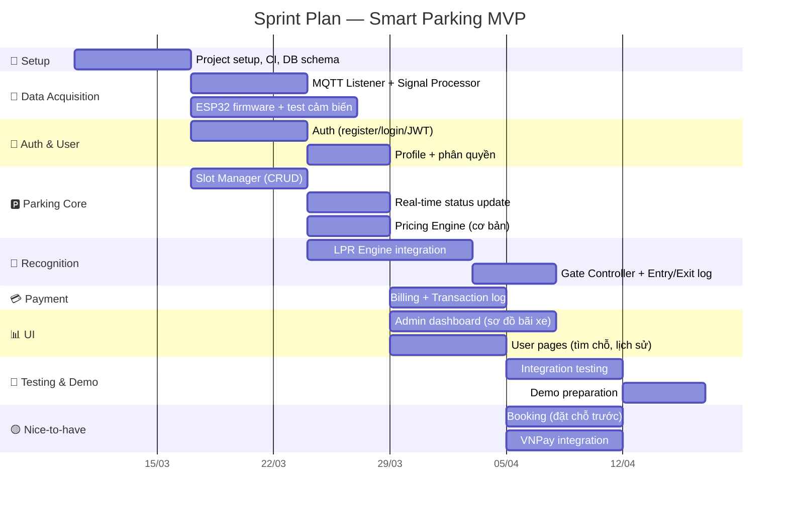

# 🎯 MVP Scope — Phạm Vi Sản Phẩm Tối Thiểu

> Xác định rõ **làm gì trước**, **làm gì sau**, và **không làm gì** để đảm bảo team 5 người ship được sản phẩm demo đúng hạn.

---

## 1. Định Nghĩa MVP

> **MVP** = phiên bản **đủ để demo** trước giảng viên, chứng minh hệ thống nhúng (ESP32 + cảm biến) **tương tác** được với phần mềm (Backend + Frontend).

### Tiêu chí MVP hoàn thành

- [ ] ESP32 gửi dữ liệu cảm biến hồng ngoại lên server qua MQTT ✅
- [ ] Server nhận, xử lý và cập nhật trạng thái ô đỗ vào DB ✅
- [ ] Frontend hiển thị sơ đồ bãi xe real-time (thấy ô đổi màu khi có xe) ✅
- [ ] User đăng ký, đăng nhập được ✅
- [ ] Camera nhận diện biển số, xe vào/ra tự động ✅
- [ ] Hệ thống tính phí và tạo hóa đơn khi xe ra ✅

---

## 2. Phân Loại Tính Năng

### 🔴 MVP — Phải có để demo

| Module | Tính năng | Lý do |
|--------|----------|-------|
| **Data Acquisition** | ESP32 gửi data cảm biến qua MQTT | Core của môn nhúng |
| **Data Acquisition** | Backend nhận & xử lý tín hiệu cảm biến | Chứng minh phần cứng ↔ phần mềm |
| **Parking Core** | Quản lý danh sách ô đỗ (CRUD) | Nền tảng cho mọi tính năng khác |
| **Parking Core** | Cập nhật trạng thái real-time từ cảm biến | Feature chính demo |
| **Parking Core** | Tính giá đơn giản (theo giờ) | Cần cho flow thanh toán |
| **User & Auth** | Đăng ký / Đăng nhập (email + password) | Phân biệt user |
| **User & Auth** | Phân quyền User / Admin | Bảo mật cơ bản |
| **Recognition** | Nhận diện biển số *(repo riêng)* | Flow xe vào/ra |
| **Recognition** | Ghi log xe vào/ra + timestamp | Cơ sở tính phí |
| **Payment** | Tạo hóa đơn khi xe ra | Hoàn thiện flow |
| **Payment** | Lưu lịch sử giao dịch | Đối soát |
| **UI** | Sơ đồ bãi xe real-time (Admin) | Feature chính demo |
| **UI** | Trang user xem ô trống | End-user experience |

### 🟡 Nice-to-have — Làm nếu còn thời gian

| Module | Tính năng | Difficulty |
|--------|----------|------------|
| **User** | Đặt chỗ trước + auto-cancel 15 phút | Medium |
| **User** | Quản lý danh sách biển số xe | Easy |
| **Payment** | Tích hợp VNPay / Momo | Hard |
| **Payment** | Ví nội bộ (nạp tiền, trừ tiền) | Medium |
| **Parking Core** | Giá theo khung giờ (cao/thấp điểm) | Medium |
| **UI** | Dashboard admin: thống kê, biểu đồ | Medium |
| **UI** | Báo cáo doanh thu ngày/tháng | Medium |
| **Data Acquisition** | Heartbeat monitor (phát hiện sensor lỗi) | Easy |
| **UI** | Cảnh báo khi bãi đầy | Easy |
| **Utilities** | Hiển thị trạng thái trên OLED | Easy |

### ⚪ Out of Scope — Không làm

| Tính năng | Lý do |
|-----------|-------|
| Mobile app native (iOS/Android) | Web responsive đủ cho demo |
| Multi-tenant (nhiều bãi xe) | Quá phức tạp, 1 bãi đủ |
| EV charging management | Ngoài scope môn học |
| AI dự đoán chỗ đỗ | Không cần thiết cho MVP |
| Push notification (Firebase) | Web notification đủ |
| OAuth (Google/Facebook login) | Email + password đủ |

---

## 3. Sprint Plan

> Giả sử tổng thời gian ≈ **10 tuần** code (trừ tuần đầu plan + tuần cuối chuẩn bị demo).

### Phân Công Theo Sprint

| Sprint | Chính | Tùng | Hùng | Chiến | Bằng |
|--------|-------|------|------|-------|------|
| **Setup** | Project setup, DB schema | Slot models | Auth models | Payment models | LPR setup |
| **Sprint 1** | MQTT Listener, ESP32 | Slot Manager API | Auth API | — | LPR Engine |
| **Sprint 2** | Signal Processor | Real-time status, Pricing | Profile, phân quyền | Booking API | Vehicle Matcher |
| **Sprint 3** | Admin Dashboard | — | User pages | Billing, Transaction | Gate Controller |
| **Sprint 4** | Integration test | Pricing nâng cao | Booking UI | VNPay *(nice-to-have)* | LPR testing |
| **Demo** | Demo prep, docs | Support | Support | Support | Support |

---

## 4. Risk & Mitigation

| Risk | Impact | Probability | Mitigation |
|------|--------|-------------|------------|
| ESP32 không kết nối WiFi ổn định | 🔴 High | Medium | Test sớm, có fallback HTTP POST |
| Cảm biến hồng ngoại sai (nhiễu) | 🟡 Medium | High | Signal Processor lọc nhiễu, debounce |
| MQTT Broker free tier bị limit | 🟡 Medium | Low | HiveMQ free tier đủ 100 connections |
| Supabase free tier hết quota | 🔴 High | Low | Monitor usage, tối ưu queries |
| Team member bận/nghỉ | 🟡 Medium | Medium | Mỗi module có owner rõ ràng |
| LPR nhận diện sai biển số | 🟡 Medium | Medium | Cho phép manual override tại cổng |
| Tích hợp VNPay/Momo phức tạp | 🟢 Low | High | Đưa vào nice-to-have, dùng mock |

---

## 5. Definition of Done (DoD)

Một tính năng được coi là **Done** khi:

- [ ] Code đã merge vào `main` qua PR
- [ ] Có ≥ 1 người review
- [ ] API endpoint hoạt động trên Swagger UI
- [ ] Có xử lý lỗi (error handling)
- [ ] Có xử lý trường hợp rỗng / không tìm thấy
- [ ] Đặt tên đúng quy ước
- [ ] Không commit file nhạy cảm (.env, __pycache__)

---

  <a href="SYSTEM_DESIGN.md">← System Design</a> •
  <a href="DATA_MODEL.md">Data Model →</a>

