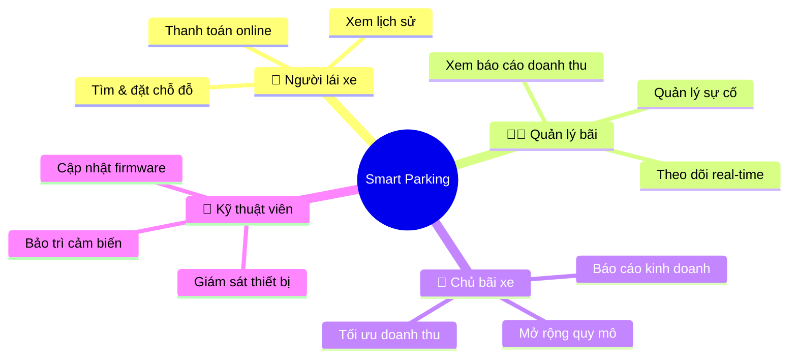
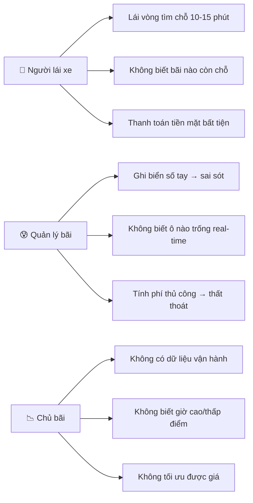
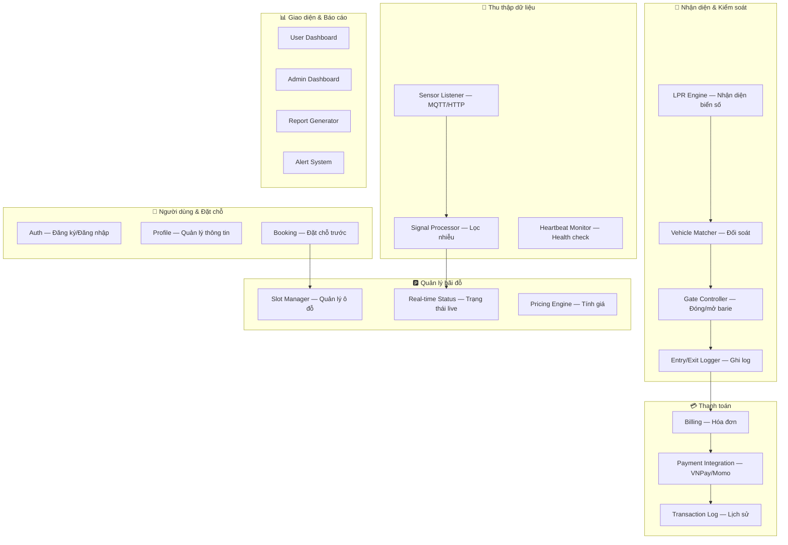
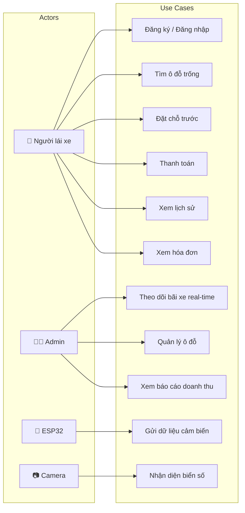
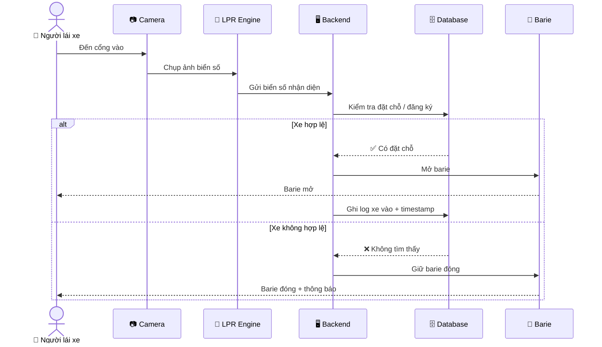
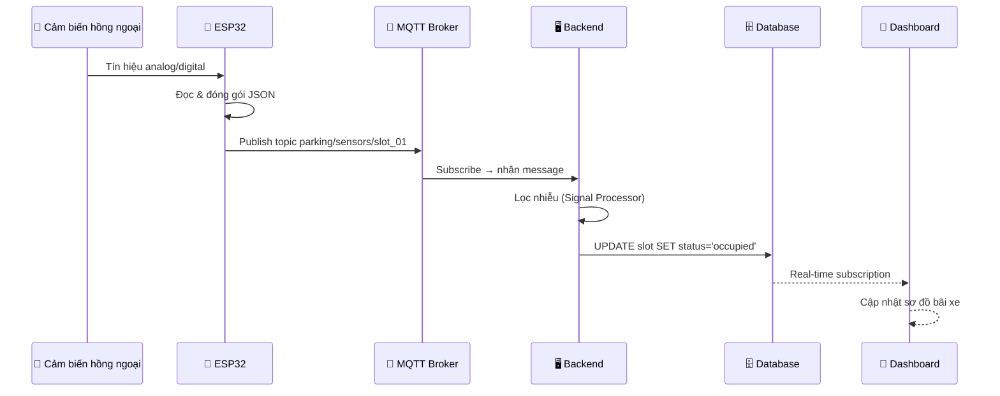
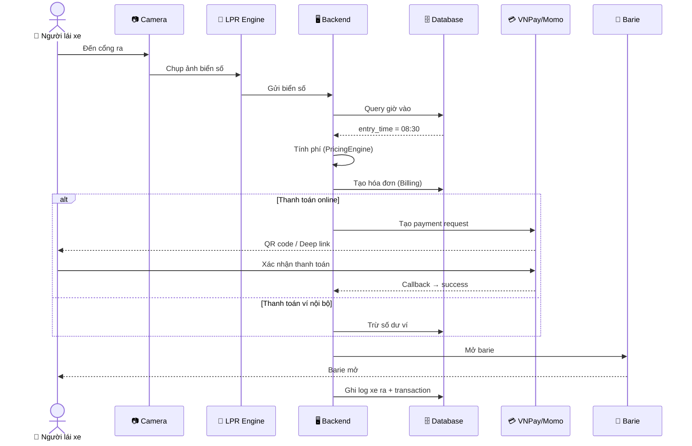

# 📋 Định Nghĩa Bài Toán (Problem Definition)

> Tài liệu phân tích bài toán Hệ thống quản lý bãi đỗ xe thông minh — Smart Parking Management System.

---

## 1. Bối Cảnh

### 🚗 Thực trạng

Tại các bãi đỗ xe ở Việt Nam, phần lớn vẫn vận hành **thủ công**:

| Vấn đề | Mô tả |
|--------|--------|
| **Tìm chỗ đỗ** | Người lái xe phải lái vòng quanh bãi để tìm ô trống, gây mất thời gian và ùn tắc nội bộ |
| **Kiểm soát ra/vào** | Bảo vệ ghi biển số bằng tay, dẫn đến sai sót, tranh cãi và rủi ro mất xe |
| **Tính phí** | Dùng vé giấy, tính phí thủ công, thiếu minh bạch, dễ thất thoát doanh thu |
| **Quản lý vận hành** | Chủ bãi không biết tỷ lệ sử dụng, giờ cao điểm, hay trạng thái cảm biến hỏng |
| **Trải nghiệm người dùng** | Không đặt chỗ trước, không thanh toán online, không biết bãi nào còn chỗ |

### 🎯 Giải pháp đề xuất

Xây dựng hệ thống **tự động hóa toàn bộ quy trình** quản lý bãi đỗ xe:

```
Cảm biến hồng ngoại + ESP32  →  Phát hiện xe tự động
Camera + Nhận diện biển số    →  Kiểm soát ra/vào tự động
Backend + Database            →  Quản lý & tính phí tự động
Mobile/Web App                →  Đặt chỗ & thanh toán online
```

---

## 2. Stakeholders



| Stakeholder | Vai trò | Nhu cầu chính |
|-------------|---------|---------------|
| **Người lái xe** | End user | Tìm chỗ nhanh, đặt trước, thanh toán tiện lợi |
| **Quản lý bãi** | Operator | Theo dõi trạng thái real-time, xử lý sự cố |
| **Chủ bãi xe** | Business owner | Tối ưu doanh thu, báo cáo, mở rộng |
| **Kỹ thuật viên** | Maintenance | Giám sát thiết bị, bảo trì phần cứng |

---

## 3. Pain Points & Goals

### ❌ Pain Points (Vấn đề hiện tại)



### ✅ Goals (Mục tiêu)

| # | Goal | Đo lường bằng |
|---|------|---------------|
| G1 | **Tự động phát hiện xe** trong ô đỗ | Độ chính xác cảm biến ≥ 95% |
| G2 | **Tự động kiểm soát ra/vào** bằng biển số | Thời gian xử lý ≤ 5 giây/xe |
| G3 | **Tính phí tự động** dựa trên thời gian đỗ | 0% sai lệch so với thực tế |
| G4 | **Đặt chỗ trước** qua app/web | Tỷ lệ đặt chỗ thành công ≥ 99% |
| G5 | **Dashboard real-time** cho quản lý | Cập nhật trạng thái ≤ 3 giây |
| G6 | **Thanh toán online** (VNPay/Momo) | Hỗ trợ ≥ 2 cổng thanh toán |
| G7 | **Báo cáo doanh thu** tự động | Xuất báo cáo ngày/tháng/năm |

---

## 4. Phạm Vi Hệ Thống

### ✅ Trong phạm vi (In Scope)



### ❌ Ngoài phạm vi (Out of Scope)

| Tính năng | Lý do loại |
|-----------|-----------|
| Hệ thống EV charging (sạc xe điện) | Phức tạp phần cứng, ngoài scope môn học |
| Đỗ xe tự động (autonomous parking) | Cần xe tự lái |
| Multi-tenant (nhiều bãi xe khác nhau) | MVP chỉ 1 bãi |
| Mobile app native (iOS/Android) | Dùng web responsive thay thế |
| AI dự đoán chỗ đỗ | Nice-to-have, không cần cho MVP |

---

## 5. Yêu Cầu Chức Năng (Functional Requirements)

### Module 1 — Data Acquisition 📡

| ID | Yêu cầu | Priority |
|----|---------|----------|
| FR-1.1 | Hệ thống nhận dữ liệu từ cảm biến hồng ngoại qua MQTT | 🔴 Must |
| FR-1.2 | Lọc nhiễu tín hiệu để xác định trạng thái Trống/Có xe | 🔴 Must |
| FR-1.3 | Phát hiện cảm biến mất kết nối trong vòng 60 giây | 🟡 Should |
| FR-1.4 | Ghi log toàn bộ dữ liệu cảm biến để debug | 🟢 Could |

### Module 3 — Parking Core 🅿️

| ID | Yêu cầu | Priority |
|----|---------|----------|
| FR-3.1 | Quản lý danh sách ô đỗ (thêm, sửa, xóa, phân loại) | 🔴 Must |
| FR-3.2 | Cập nhật trạng thái ô đỗ real-time khi cảm biến thay đổi | 🔴 Must |
| FR-3.3 | Hỗ trợ phân loại ô đỗ: xe máy, ô tô, xe điện | 🟡 Should |
| FR-3.4 | Tính giá dựa trên: loại xe × khung giờ × thời gian đỗ | 🔴 Must |
| FR-3.5 | Hỗ trợ giá theo giờ, theo lượt, theo ngày | 🟡 Should |

### Module 4 — User & Reservation 👤

| ID | Yêu cầu | Priority |
|----|---------|----------|
| FR-4.1 | Đăng ký tài khoản bằng email | 🔴 Must |
| FR-4.2 | Đăng nhập / Đăng xuất an toàn (JWT) | 🔴 Must |
| FR-4.3 | Phân quyền User / Admin | 🔴 Must |
| FR-4.4 | User quản lý danh sách biển số xe | 🟡 Should |
| FR-4.5 | Đặt chỗ trước, giữ chỗ trong 15 phút | 🟡 Should |
| FR-4.6 | Tự động hủy đặt chỗ nếu quá hạn | 🟡 Should |

### Module 5 — Payment 💳

| ID | Yêu cầu | Priority |
|----|---------|----------|
| FR-5.1 | Tạo hóa đơn tự động khi xe rời bãi | 🔴 Must |
| FR-5.2 | Hỗ trợ thanh toán qua VNPay hoặc Momo | 🟡 Should |
| FR-5.3 | Quản lý ví nội bộ (nạp tiền, trừ tiền) | 🟢 Could |
| FR-5.4 | Lưu lịch sử giao dịch đầy đủ | 🔴 Must |

### Module 6 — UI & Analytics 📊

| ID | Yêu cầu | Priority |
|----|---------|----------|
| FR-6.1 | Dashboard user: xem ô trống, đặt chỗ, xem ví | 🔴 Must |
| FR-6.2 | Dashboard admin: bản đồ bãi xe real-time | 🔴 Must |
| FR-6.3 | Báo cáo doanh thu theo ngày/tháng/năm | 🟡 Should |
| FR-6.4 | Cảnh báo khi bãi đầy hoặc cảm biến lỗi | 🟡 Should |

### Module 7 — Utilities 🔧

| ID | Yêu cầu | Priority |
|----|---------|----------|
| FR-7.1 | Hiển thị trạng thái ô đỗ trên màn OLED | 🟡 Should |
| FR-7.2 | Thông báo bằng loa khi xe vào/ra | 🟢 Could |
| FR-7.3 | Sơ đồ bãi xe trực quan trên web | 🔴 Must |

---

## 6. Yêu Cầu Phi Chức Năng (Non-Functional Requirements)

| Loại | Yêu cầu | Chỉ số |
|------|---------|--------|
| ⚡ **Performance** | API response time | ≤ 500ms (P95) |
| ⚡ **Performance** | Cập nhật trạng thái cảm biến | ≤ 3 giây end-to-end |
| ⚡ **Performance** | Concurrent users | ≥ 50 users đồng thời |
| 🔒 **Security** | Authentication | JWT + Supabase Auth |
| 🔒 **Security** | Authorization | Row Level Security (RLS) |
| 🔒 **Security** | Dữ liệu nhạy cảm | Không lưu plain-text password |
| 📈 **Scalability** | Số ô đỗ | ≥ 100 ô đỗ |
| 📈 **Scalability** | Số cảm biến | ≥ 100 cảm biến đồng thời |
| 🔄 **Reliability** | Uptime | ≥ 99% trong giờ hoạt động |
| 🔄 **Reliability** | Mất kết nối cảm biến | Tự động phát hiện trong 60s |
| 🧪 **Testability** | Unit test coverage | ≥ 60% cho services |
| 📱 **Usability** | Responsive | Hoạt động trên mobile browser |

---

## 7. Constraints (Ràng buộc)

| Ràng buộc | Chi tiết |
|-----------|---------|
| **Team size** | 5 thành viên |
| **Thời gian** | Trong khuôn khổ 1 học kỳ (≈ 15 tuần) |
| **Ngân sách** | Miễn phí (Supabase Free tier, MQTT broker miễn phí) |
| **Phần cứng** | ESP32 DevKit + cảm biến hồng ngoại (có sẵn) |
| **Môn học** | Hệ thống Nhúng — cần phần cứng tương tác phần mềm |
| **Demo** | Cần mô hình bãi xe thu nhỏ hoạt động được |

---

## 8. Sơ Đồ Use Case Tổng Quan



---

## 9. Luồng Nghiệp Vụ Chính

### 🚗 Luồng 1: Xe vào bãi



### 🅿️ Luồng 2: Cảm biến phát hiện xe



### 💳 Luồng 3: Xe ra bãi & thanh toán



---

<p align="center">
  <b>Tài liệu tiếp theo:</b> <a href="SYSTEM_DESIGN.md">🏗️ System Design →</a>
</p>
