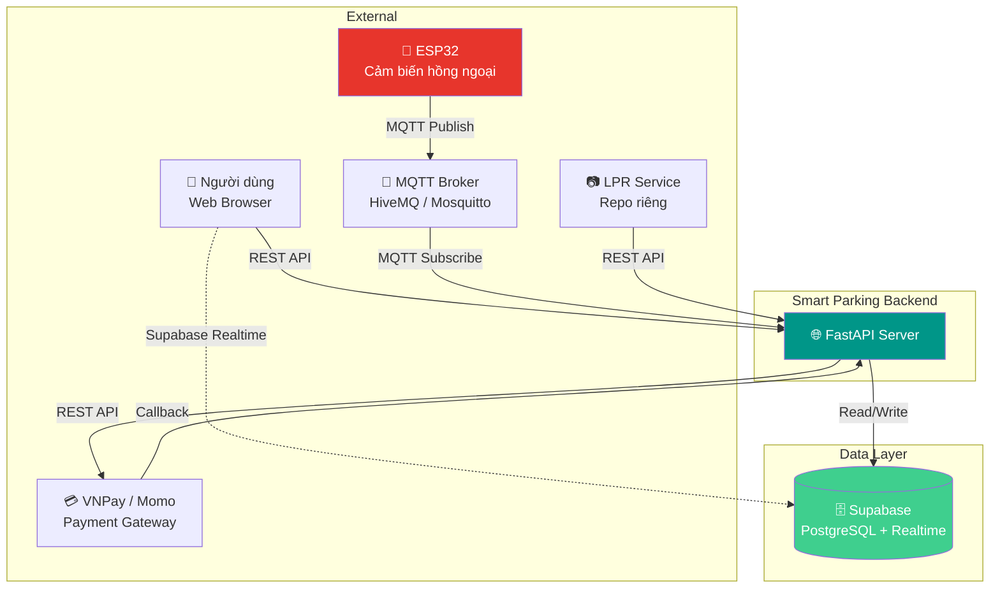
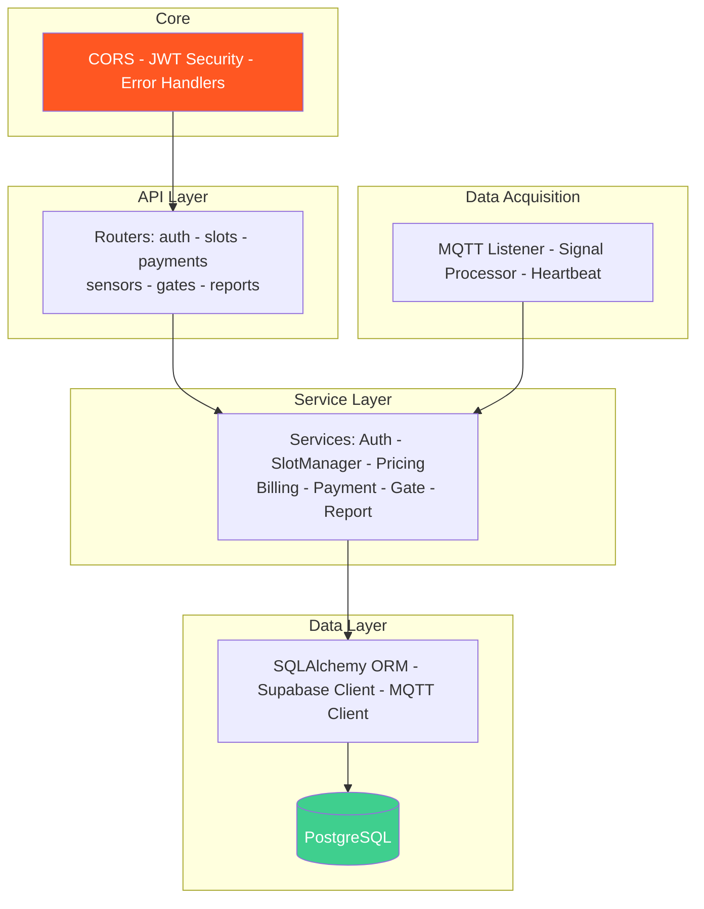
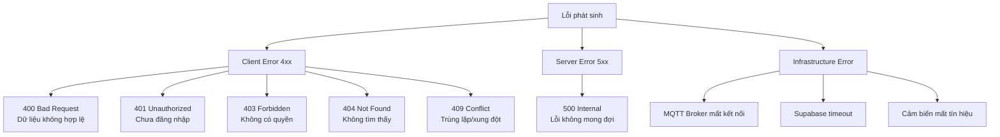
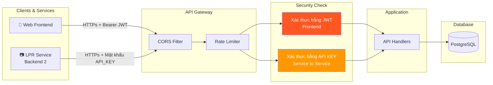
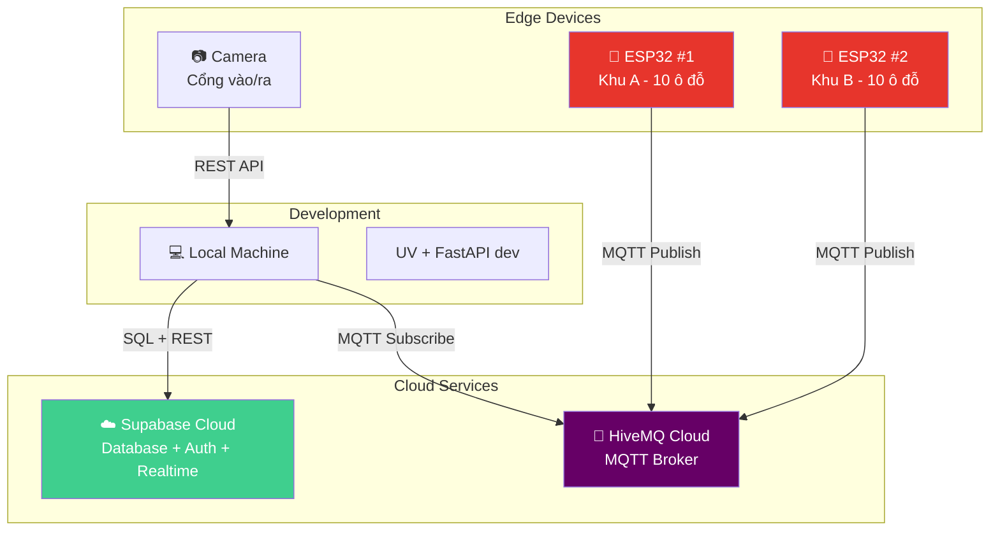

# 🏗️ System Design — Thiết Kế Hệ Thống

> Tài liệu thiết kế hệ thống tổng thể cho Smart Parking Management System.

---

## 1. System Context

Hệ thống giao tiếp với các thành phần bên ngoài:



---

## 2. High-Level Components



---

## 3. Giao Tiếp Giữa Các Hệ Thống Con

| Từ | Đến | Phương thức | Dữ liệu | Ghi chú |
|----|-----|------------|----------|---------|
| ESP32 | MQTT Broker | **MQTT Publish** | `{ slot_id, value, timestamp }` | Topic: `parking/sensors/{slot_id}` |
| MQTT Broker | Backend | **MQTT Subscribe** | Tương tự trên | Backend subscribe topic wildcard |
| LPR Service | Backend | **REST POST** | `multipart/form-data` (plate_number, gate_id, image_file) | Upload ảnh qua file đính kèm |
| Backend | Supabase Storage | **API Upload** | Image binary | Backend upload ảnh lên bucket, nhận `public_url` gắn vào database |
| Backend | VNPay/Momo | **REST POST** | `{ amount, order_id, return_url }` | Tạo payment request |
| VNPay/Momo | Backend | **HTTP Callback** | `{ status, transaction_id }` | IPN callback khi thanh toán xong |
| Backend | Supabase | **PostgreSQL** | SQL queries | Qua SQLAlchemy ORM |
| Supabase | Frontend | **Supabase Realtime** | `{ slot_id, status, updated_at }` | Frontend subscribe trực tiếp, không qua backend |

---

## 4. Chi Tiết Protocol MQTT

### Topic Structure

```
parking/
├── sensors/
│   ├── slot_001          # Dữ liệu từ cảm biến ô đỗ 001
│   ├── slot_002
│   └── ...
├── heartbeat/
│   ├── esp32_01          # Heartbeat từ ESP32 board 01
│   └── ...
└── commands/
    └── gate/             # Lệnh đóng/mở barie
```

### Payload Format

```json
// Topic: parking/sensors/slot_001
{
  "slot_id": "slot_001",
  "value": 1,
  "raw_value": 2847,
  "board_id": "esp32_01",
  "timestamp": 1709712000
}
```

| Field | Type | Mô tả |
|-------|------|--------|
| `slot_id` | string | ID ô đỗ |
| `value` | int | `1` = có xe, `0` = trống |
| `raw_value` | int | Giá trị thô từ cảm biến (debug) |
| `board_id` | string | ID board ESP32 |
| `timestamp` | int | Unix timestamp |

### QoS & Retention

| Setting | Giá trị | Lý do |
|---------|---------|-------|
| QoS | **1** (At least once) | Đảm bảo data không mất, chấp nhận duplicate |
| Retain | **true** | Khi backend restart, nhận được state cuối cùng |
| Keep Alive | **60s** | Phát hiện mất kết nối nhanh |

---

## 5. Công Nghệ & Lý Do Chọn

| Thành phần | Công nghệ | Lý do |
|-----------|-----------|-------|
| **Backend Framework** | FastAPI | Async, auto docs (Swagger), type hints, performance tốt |
| **ORM** | SQLAlchemy | Mature, relationship mapping mạnh, migration support |
| **Database** | Supabase (PostgreSQL) | Free tier đủ dùng, built-in Auth/RLS, Realtime subscriptions |
| **Package Manager** | UV | Nhanh gấp 10-100x pip, lockfile chính xác, từ Astral |
| **Type Checker** | ty | Nhanh gấp 10-100x mypy, từ Astral, tích hợp tốt với UV |
| **Linter** | Ruff | Nhanh, thay thế cả flake8 + isort + black, từ Astral |
| **IoT Protocol** | MQTT | Lightweight, pub/sub phù hợp IoT, hỗ trợ QoS |
| **MQTT Broker** | HiveMQ Cloud | Free tier, managed, không cần tự host |
| **Auth** | Supabase Auth + JWT | Sẵn có, hỗ trợ OAuth, email/password |
| **Microcontroller** | ESP32 | WiFi built-in, GPIO đủ, Arduino/PlatformIO support |
| **Cảm biến** | Hồng ngoại (IR) | Rẻ, đơn giản, phát hiện vật cản chính xác |

---

## 6. Sequence Diagrams Chi Tiết

*(Các Sequence Diagram chi tiết về luồng xe chạy đã được di chuyển sang file ARCHITECTURE.md mục 2)*

## 7. Error Handling Strategy

### Phân Loại Lỗi



### Response Format Thống Nhất

```json
// ✅ Success
{
  "success": true,
  "data": { ... },
  "message": "Thao tác thành công"
}

// ❌ Error
{
  "success": false,
  "error": {
    "code": "SLOT_NOT_FOUND",
    "message": "Ô đỗ slot_042 không tồn tại",
    "details": null
  }
}
```

### Error Codes

| Code | HTTP | Mô tả |
|------|------|--------|
| `VALIDATION_ERROR` | 400 | Dữ liệu request không hợp lệ |
| `UNAUTHORIZED` | 401 | Token hết hạn hoặc không hợp lệ |
| `FORBIDDEN` | 403 | Không có quyền thực hiện thao tác |
| `NOT_FOUND` | 404 | Resource không tồn tại |
| `SLOT_NOT_AVAILABLE` | 409 | Ô đỗ đã có xe hoặc đã được đặt |
| `BOOKING_EXPIRED` | 409 | Đặt chỗ đã hết hạn |
| `INSUFFICIENT_BALANCE` | 402 | Số dư ví không đủ |
| `PAYMENT_FAILED` | 502 | Cổng thanh toán lỗi |
| `SENSOR_OFFLINE` | 503 | Cảm biến mất kết nối |
| `INTERNAL_ERROR` | 500 | Lỗi server không xác định |

---

## 8. Security Architecture



### Các Lớp Bảo Mật

| Lớp | Cơ chế | Mô tả |
|-----|--------|--------|
| **Transport** | HTTPS | Mã hóa toàn bộ traffic |
| **CORS** | Whitelist origins | Chỉ cho phép domain frontend |
| **Rate Limiting** | Token bucket | Chống brute force, DDoS |
| **Authentication** | JWT (Supabase) | Xác thực người dùng |
| **Authorization** | Role-based (User/Admin) | Phân quyền theo vai trò |
| **Data** | RLS (PostgreSQL) | User chỉ thấy data của mình |
| **Input** | Pydantic validation | Validate mọi input từ client |
| **Secrets** | `.env` + Supabase Vault | Không hardcode secrets |

---

## 9. Deployment Overview



> [!NOTE]
> **Môi trường demo**: Backend chạy trên máy local, kết nối Supabase Cloud và HiveMQ Cloud. ESP32 kết nối WiFi cùng mạng LAN hoặc qua internet.

---

<p align="center">
  <a href="PROBLEM_DEFINITION.md">← Định nghĩa bài toán</a> •
  <a href="MVP_SCOPE.md">Phạm vi MVP →</a>
</p>
