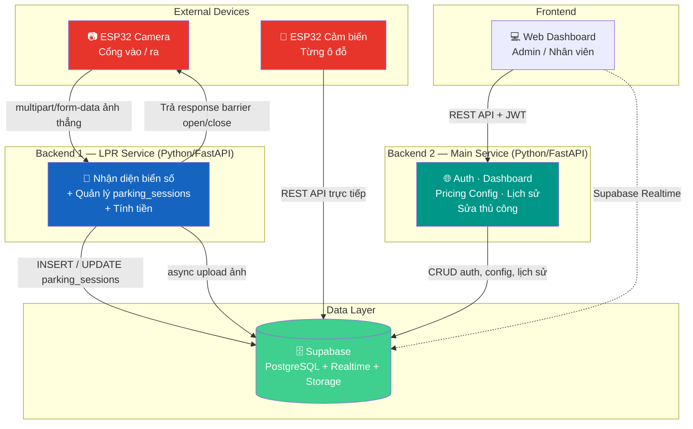
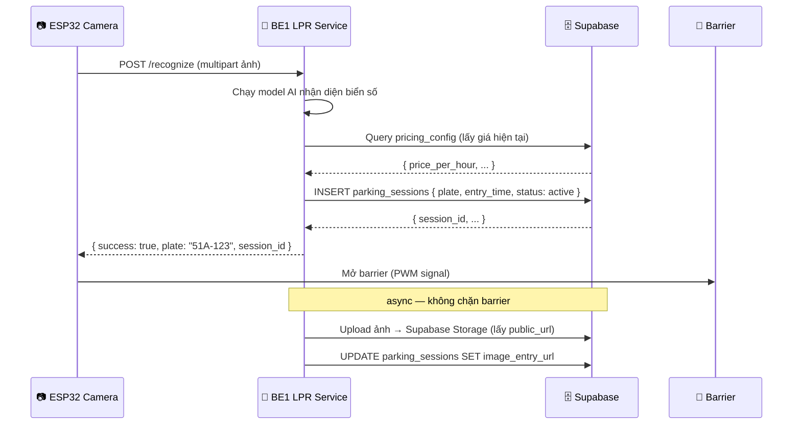
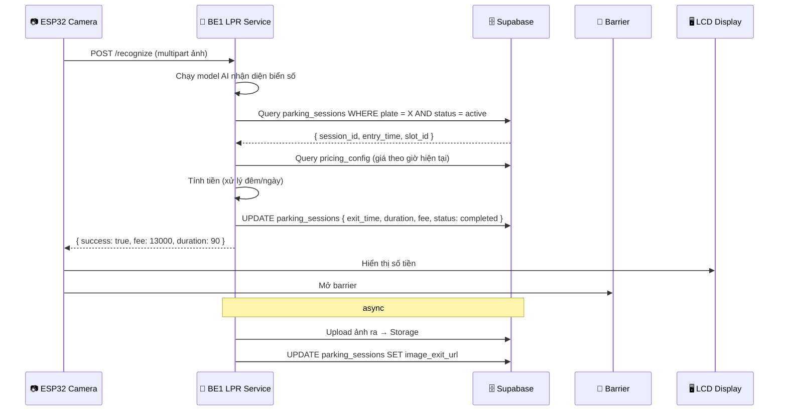
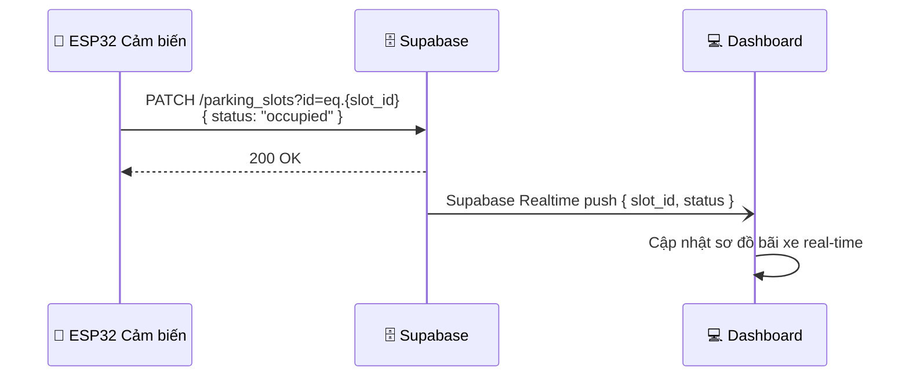
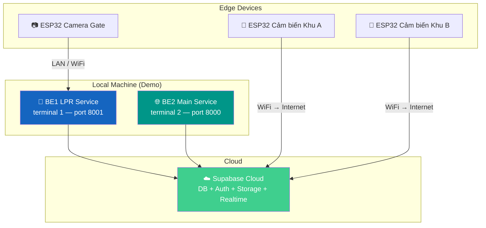

# 🏗️ System Design — Thiết Kế Hệ Thống

> Tài liệu thiết kế hệ thống tổng thể cho Smart Parking Management System.

---

## 1. System Context

Hệ thống gồm 2 backend độc lập, giao tiếp với các thành phần bên ngoài:

---

## 2. Phân Chia Trách Nhiệm Rõ Ràng

| | Backend 1 — LPR Service | Backend 2 — Main Service |
|---|---|---|
| **Vai trò** | Xử lý luồng xe vào/ra | Quản lý hệ thống |
| **Owns table** | `parking_sessions` | `users`, `pricing_config`, `parking_slots` (config) |
| **Trigger** | ESP32 Camera gửi ảnh | Web Dashboard, Admin |
| **Logic** | Nhận diện AI + tính tiền | Auth, thống kê, cấu hình |
| **Barrier** | Trả lệnh mở/đóng | Không liên quan |

> **Nguyên tắc:** 2 BE **không gọi nhau**, đều đọc/ghi Supabase trực tiếp. Tách concern rõ ràng, 1 cái crash cái kia vẫn sống.

---

## 3. Luồng Xe Vào Chi Tiết

---

## 4. Luồng Xe Ra Chi Tiết

---

## 5. Luồng Cảm Biến Ô Đỗ

> ESP32 cảm biến gọi **thẳng Supabase REST API** — không cần qua backend nào. Logic đơn giản, giảm tải hoàn toàn cho cả 2 BE.

---

## 6. Công Nghệ Sử Dụng

| Thành phần | Công nghệ | Lý do |
|-----------|-----------|-------|
| **BE1 LPR** | Python FastAPI | Async, tích hợp AI/ML dễ |
| **BE2 Main** | Python FastAPI | Đồng nhất stack, auto Swagger |
| **ORM** | SQLAlchemy | Mature, migration support |
| **Database** | Supabase (PostgreSQL) | Free tier, Realtime, Auth, Storage sẵn |
| **Realtime** | Supabase Realtime | Dashboard cập nhật sơ đồ bãi xe |
| **Storage** | Supabase Storage | Lưu ảnh biển số vào/ra |
| **IoT** | ESP32 WiFi | Built-in WiFi, GPIO đủ dùng |
| **Cảm biến** | Hồng ngoại (IR) | Đơn giản, chính xác, rẻ |
| **Package Manager** | UV | Nhanh hơn pip 10-100x |
| **Linter** | Ruff | Thay thế flake8 + black + isort |
| **Payment** | Tiền mặt (v1) | Đơn giản, đủ cho MVP — nâng cấp VNPay/Momo sau |

---

## 7. Deployment Overview

> **Môi trường demo:** 2 backend chạy local (2 terminal), kết nối Supabase Cloud. ESP32 cùng mạng LAN hoặc qua internet.

---

## 8. Bottleneck & Optimization

> Optimize đúng chỗ, không waste thời gian vào những thứ không phải vấn đề.

| Yếu tố | Ảnh hưởng | Hành động |
|--------|-----------|-----------|
| ESP32 WiFi upload ảnh | ⚠️ Cao | Resize ảnh về 640×480 trước khi gửi |
| Model AI nhận diện | ⚠️ Cao | Dùng model nhẹ (YOLOv8n + EasyOCR) |
| Upload Storage (ảnh) | ✅ Không chặn | Chạy async sau khi mở barrier |
| HTTP call giữa 2 BE | ✅ Không có | 2 BE không gọi nhau |
| Supabase write | ✅ Chấp nhận được | ~100ms, không ảnh hưởng UX |

**Thứ tự ưu tiên tối ưu:**
1. Chất lượng + kích thước ảnh từ ESP32
2. Tốc độ model AI (inference time)
3. Ổn định WiFi tại cổng vào/ra

---

  <a href="PROBLEM_DEFINITION.md">← Định nghĩa bài toán</a> •
  <a href="MVP_SCOPE.md">Phạm vi MVP →</a>

